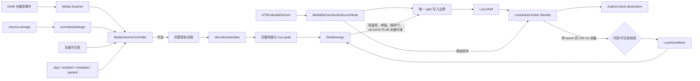

# Volume Equalizer 架构

权威行为定义见 [PRODUCT_BEHAVIOR.md](PRODUCT_BEHAVIOR.md)。

## 系统流程

## 状态修改边界

- `main.ts`：控制器集合、当前 UI 媒体、规范化后的全局设置、绑定失败重试与面板提示。
- `controller.ts`：媒体生命周期、测量 epoch、分析尝试代际和唯一 gain 写入。
- `gain-control.ts`：纯增益决策状态，不直接访问 DOM 或 Web Audio 节点。
- `limiter-worklet.js`：按输入声道数逐声道实时限峰和带 epoch 的连续测量，不决定节目 gain，不做立体声降混。
- `settings.ts`：所有持久化设置的运行时校验与跨标签同步。

## 安全降级

Worklet 未就绪或失败时，信号仍经过当前安全 gain、bass 和
`DynamicsCompressorNode` limiter，但实时 AGC 暂停。系统不使用 rAF 读取的重叠
Analyser 快照更新 gain，因为其时间轴不是连续 PCM。
